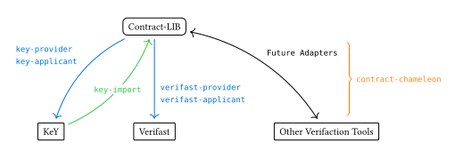
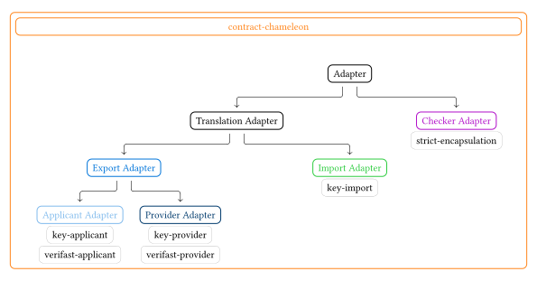

# `contract-chameleon`

## What is [contract-chameleon](https://github.com/Contract-LIB/contract-chameleon), and what not?

`contract-chameleon` is a translator to transfer
different formal specification contracts, into each other,
so the proven contracts in one tool can also be applied in another tool.
To make these translations scalable in the number of tools supported
it uses `Contract-LIB` based on `SML-LIB`
as an intermediate representation of the contracts.

Contract-Chameleon itself does not proof any implementation,
nor does it manage proofs.

The following diagram should give an idea,
how `Contract-LIB` unfolds is potential as an intermediate language
between multiple deductive verification tools.
The tool `contract-chameleon` fills the gap to create the required connections,
between the different tool-specific contract representations and `Contract-LIB`.



## Some basic terminology

There is some basic terminology when it comes to `contract-chameleon`:
Simply speaking, every adapter is named from the perspective of `contract-chameleon`.

This means that `import`-adapters take a specification
in one of the tool specific languages (e.g., `JML (JavaDL)`)
and translate it into a `Contract-LIB` specification.

However, `export`-adapters translate a `Contract-LIB` specification
to an application's specification.
In contrast to the `import`-adapters where only one use case exists,
there can be two ways to export a `Contract-LIB` specification.
The `provider`-perspective generates the interface the implementation
needs to be proven against.
The `applicant`- (or `client`-) perspective only generates the specification
for an interface of a contract
that can be used in the client tool.

Additionally, the `checker`-adapter serves the purpose,
to perform some more specific checks on the provided contracts,
when there are further restrictions required for the translation.

The following diagram visualizes the relation
between the different types of adapters that exist is `contract-chameleon`.
It also gives an overview over existing adapters at the moment.



## Available Adapters

- [`KeY` adapters](https://github.com/Contract-LIB/contract-chameleon-key):
  - `key-provider`
  - `key-applicant`
  - `key-universe` (work in progress)
  - `key-import`
- [`VeriFast` adapters](https://github.com/Contract-LIB/contract-chameleon-verifast):
  - `verifast-provider`
  - `verifast-applicant`

## Running the tool

The tool with all default adapters can be run with:

```sh
java -jar contract-chameleon-exe.jar <adapter-name>
```

### Help

The command line interface provides a help argument,
to list a help message.

```sh
java -jar contract-chameleon-exe.jar --help 
```

You can also pass this argument to all of the existing adapters,
to get further information about the usage and the arguments of the specific adapters.

```sh
java -jar contract-chameleon-exe.jar key-provider --help 
```

### Executing additional adapters

Place the `JAR` of the additional adapter next to the `contract-chameleon-exe.jar`:

```sh
java -cp '*' org.contract_lib.ContractChameleon <adapter-name> --help
```

The additional `JAR` must have a file with the name `org.contract_lib.contract_chameleon.Adapter`
in `src/main/ressources/META-INF/services`
containing the full class name (including package) of the additional adapter.

## Developing the tool

### Writing custom adapters for `contract-chameleon`

To write a custom adapter for `contract-chameleon`,
a basic template with recommendations is provided here:
[`adapter-extension`](https://github.com/Contract-LIB/contract-chameleon-adapter-extension):

### Building `contract-chameleon` locally

You can build the core package of `contract-chameleon` yourself,
with its dependencies by following the following steps:

1. Cloning the git directory

    ```sh
    git clone git@github.com:Contract-LIB/contract-chameleon.git contract-chameleon
    ```

1. Build `contract-chameleon` with `gradle`

    ```sh
    # Ensure to be at root of contract chameleon
    gradle clean build
    ```

1. Execute `contract-chameleon`

    ```sh
    gradle run --args="<adapter-name> <file_path>"
    ```

### Accessing the JavaDoc

For each module the `JavaDoc` can be found in
`<module>/build/docs/javadoc/org/contract_lib/contract_chameleon/package-summary.html`.
